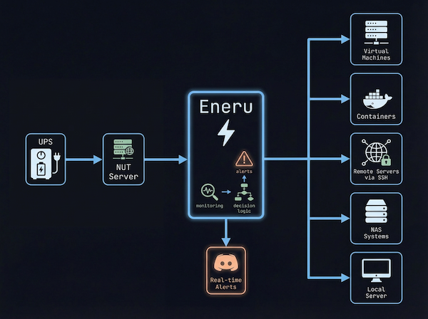

# Eneru

  

**Intelligent UPS Monitoring & Shutdown Orchestration for NUT**

A Python-based UPS monitoring daemon that watches UPS status via [Network UPS Tools (NUT)](https://networkupstools.org/) and executes configurable shutdown sequences to protect your entire infrastructure during power events.

---

## Why Eneru?

Most UPS shutdown solutions are **single-system focused**. Eneru is designed for **modern infrastructure**:

| Challenge | Eneru Solution |
|-----------|----------------|
| Multiple servers need coordinated shutdown | ✅ Orchestrated multi-server shutdown via SSH |
| VMs and containers need graceful stop | ✅ Libvirt VM and Docker/Podman container handling |
| Network mounts hang during power loss | ✅ Timeout-protected unmounting |
| No visibility during power events | ✅ Real-time notifications via 100+ services |
| Different systems need different commands | ✅ Per-server custom shutdown commands |
| Hypervisors need graceful VM shutdown | ✅ Pre-shutdown actions (Proxmox, ESXi, XCP-ng, libvirt) |
| Battery estimates are unreliable | ✅ Multi-vector shutdown triggers |
| Network down during outage might block/slow down shutdown | ✅ Non-blocking notifications with persistent retry |

---

## 🎯 Built For

- 🏠 **Homelabs** - Protect your self-hosted infrastructure
- 🖥️ **Virtualization Hosts** - Graceful VM shutdown before power loss
- 🐳 **Container Hosts** - Stop Docker/Podman containers safely
- 📦 **NAS Systems** - Coordinate shutdown of Synology, QNAP, TrueNAS
- 🏢 **Small Business** - Multi-server environments with single UPS
- ☁️ **Hybrid Setups** - Mix of physical and virtual infrastructure

---

## ✨ Features

### High-Performance Monitoring

- **Optimized Polling:** Fetches all UPS metrics in a single network call with configurable intervals
- **Robust Error Handling:** Comprehensive input validation prevents failures from corrupted or transient data
- **Atomic State Updates:** Uses atomic file operations for data integrity
- **Connection Resilience:** Automatic recovery from network issues with stale data detection

### Intelligent Shutdown Triggers

Multiple shutdown conditions with configurable thresholds:

1. **FSD Flag:** UPS signals forced shutdown (highest priority)
2. **Critical Battery Level:** Battery percentage below threshold (default: 20%)
3. **Critical Runtime:** Estimated runtime below threshold (default: 10 minutes)
4. **Dangerous Depletion Rate:** Battery draining faster than threshold (default: 15%/min)
5. **Extended Time on Battery:** Safety net for aged batteries (default: 15 minutes)
6. **Failsafe (FSB):** Connection lost while on battery triggers immediate shutdown

See [Shutdown Triggers](triggers.md) for detailed documentation.

### Configurable Shutdown Sequence

All components are optional and independently configurable:

1. **Virtual Machines (libvirt/KVM):** Graceful shutdown with force-destroy fallback
2. **Containers (Docker/Podman):** Stop all running containers with auto-detection
3. **Filesystem Sync:** Flush buffers to disk
4. **Filesystem Unmount:** Hang-proof unmounting with per-mount options
5. **Remote Servers:** SSH-based shutdown of multiple remote systems
6. **Local Shutdown:** Configurable shutdown command

### Real-Time Notifications (via Apprise)

- **100+ Notification Services:** Discord, Slack, Telegram, ntfy, Pushover, Email, and [many more](https://github.com/caronc/apprise/wiki)
- **Non-Blocking with Persistent Retry:** Notifications never delay shutdown, retried until delivered
- **Power Event Alerts:** Color-coded notifications for all power events
- **Service Lifecycle:** Notifications when service starts/stops

See [Notifications](notifications.md) for the architecture and setup guide.

### Power Quality Monitoring

- **Voltage Monitoring:** Brownout and over-voltage detection
- **AVR Tracking:** Boost/Trim mode detection
- **Bypass Detection:** Alerts when UPS protection is inactive
- **Overload Detection:** Load threshold monitoring

### Tested on Every Commit

Every commit triggers the full test suite across 7 Linux distributions (Debian, Ubuntu, RHEL) and 6 Python versions, ensuring no regressions. Before each release, Eneru is validated on real hardware with actual UPS units and simulated power events. See [Testing](testing.md) for details.

---

## 🤔 Why a Systemd Daemon? (No Docker)

You might wonder why Eneru runs as a traditional systemd service instead of a container. This is intentional:

**The Chicken-and-Egg Problem:** Eneru's job is to gracefully shut down Docker/Podman containers during power events. If Eneru itself ran inside a container, it would be stopped during its own shutdown sequence—potentially stalling the entire process and leaving the host in an undefined state.

Running as a systemd daemon ensures:

- **Eneru survives container shutdown** - It can orchestrate the full sequence without being killed
- **Direct host access** - Native access to systemd, virsh, SSH, and filesystem operations
- **Reliability** - No container runtime dependency that could fail during a power event
- **Simplicity** - While it's technically possible to code Eneru to run inside a container (with careful self-exclusion logic during shutdown), this would significantly increase codebase complexity and still introduce the possibility that something goes wrong—leaving Eneru unable to complete its job

This is the same reason critical infrastructure services like NUT itself run as system daemons, not containers.

---

## ⚡ The Name

Named after [Eneru (エネル)](https://onepiece.fandom.com/wiki/Enel) from *One Piece*—the self-proclaimed God of Skypiea who ate the Goro Goro no Mi (Rumble-Rumble Fruit), granting him absolute control over electricity. Just as Eneru commands lightning from the sky, this tool commands your infrastructure when the power from the grid fails. *Unlimited power... management!* ⚡

---

## Quick Start

Ready to get started? Head to [Getting Started](getting-started.md) for installation instructions.
