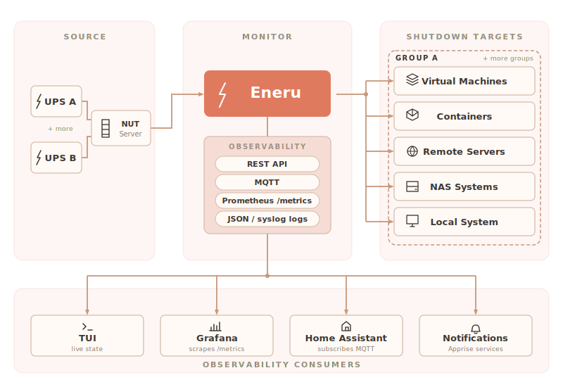

# Eneru

  

**UPS monitoring and shutdown orchestration for NUT**

A Python-based UPS monitoring daemon that watches UPS status via [Network UPS Tools (NUT)](https://networkupstools.org/) and runs configurable shutdown sequences to protect your infrastructure during power events.

---

## Why Eneru?

Most UPS shutdown solutions handle a single system. Eneru handles multi-system environments:

| Challenge | Eneru Solution |
|-----------|----------------|
| Multiple servers need coordinated shutdown | ✅ Orchestrated multi-server shutdown via SSH |
| VMs and containers need graceful stop | ✅ Libvirt VM and Docker/Podman container handling |
| Network mounts hang during power loss | ✅ Timeout-protected unmounting |
| No visibility during power events | ✅ Real-time notifications via 100+ services |
| Different systems need different commands | ✅ Per-server custom shutdown commands |
| Hypervisors need graceful VM shutdown | ✅ Pre-shutdown actions (Proxmox, ESXi, XCP-ng, libvirt) |
| Battery estimates are unreliable | ✅ Multi-vector shutdown triggers |
| Network down during outage might block/slow down shutdown | ✅ Non-blocking notifications with persistent retry |

---

## Built for

- **Homelabs** - Protect your self-hosted infrastructure
- **Virtualization hosts** - Graceful VM shutdown before power loss
- **Container hosts** - Stop Docker/Podman containers safely
- **NAS systems** - Coordinate shutdown of Synology, QNAP, TrueNAS
- **Small business** - Multi-server environments with single UPS
- **Hybrid setups** - Mix of physical and virtual infrastructure

---

## Features

### Monitoring

- **Single-call polling:** Fetches all UPS metrics in one network call with configurable intervals
- **Input validation:** Prevents failures from corrupted or transient data
- **Atomic state updates:** Uses atomic file operations for data integrity
- **Connection recovery:** Automatic reconnection with stale data detection

### Shutdown triggers

Multiple shutdown conditions with configurable thresholds:

1. **FSD flag:** UPS signals forced shutdown (highest priority)
2. **Critical battery level:** Battery percentage below threshold (default: 20%)
3. **Critical runtime:** Estimated runtime below threshold (default: 10 minutes)
4. **Dangerous depletion rate:** Battery draining faster than threshold (default: 15%/min)
5. **Extended time on battery:** Safety net for aged batteries (default: 15 minutes)
6. **Failsafe (FSB):** Connection lost while on battery triggers immediate shutdown

See [Shutdown triggers](triggers.md) for details.

### Shutdown sequence

All components are optional and independently configurable:

1. **Virtual machines (libvirt/KVM):** Graceful shutdown with force-destroy fallback
2. **Containers (Docker/Podman):** Stop all running containers with auto-detection
3. **Filesystem sync:** Flush buffers to disk
4. **Filesystem unmount:** Hang-proof unmounting with per-mount options
5. **Remote servers:** SSH-based shutdown of multiple remote systems
6. **Local shutdown:** Configurable shutdown command

### Notifications (via Apprise)

- **100+ services:** Discord, Slack, Telegram, ntfy, Pushover, email, and [many more](https://github.com/caronc/apprise/wiki)
- **Non-blocking with persistent retry:** Notifications never delay shutdown, retried until delivered
- **Power event alerts:** Color-coded notifications for all power events
- **Service lifecycle:** Notifications when service starts/stops

See [Notifications](notifications.md) for setup.

### Power quality monitoring

- **Voltage monitoring:** Brownout and over-voltage detection
- **AVR tracking:** Boost/Trim mode detection
- **Bypass detection:** Alerts when UPS protection is inactive
- **Overload detection:** Load threshold monitoring

### Tested on every commit

Every commit triggers the full test suite:

- **190 unit tests** across 7 Python versions (3.9-3.14, plus 3.15-dev)
- **Integration tests** verifying package installation on 7 Linux distributions (Debian, Ubuntu, RHEL)
- **End-to-end tests** with real NUT server, SSH target, and Docker containers in CI

The E2E test suite simulates 8 UPS scenarios (online, low-battery, FSD, brownout, etc.) and validates the complete shutdown workflow, from power failure detection to SSH remote shutdown. Before each release, Eneru is also validated on real hardware with actual UPS units and simulated power events. See [Testing](testing.md) for details.

### Modular architecture (v4.10+)

9 focused modules:

- `config.py` - Configuration dataclasses and YAML loader
- `monitor.py` - Core UPS monitoring logic
- `notifications.py` - Non-blocking notification worker
- `cli.py` - Command-line interface
- Plus: `version.py`, `state.py`, `logger.py`, `utils.py`, `actions.py`

---

## Why a systemd daemon? (No Docker)

Eneru runs as a systemd service, not a container. This is intentional.

Eneru's job is to shut down Docker/Podman containers during power events. If Eneru itself ran inside a container, it would be stopped during its own shutdown sequence, potentially stalling the process and leaving the host in an undefined state.

Running as a systemd daemon means:

- **Survives container shutdown** - It can orchestrate the full sequence without being killed
- **Direct host access** - Native access to systemd, virsh, SSH, and filesystem operations
- **No runtime dependency** - The container runtime itself could fail during a power event
- **Less complexity** - Running inside a container would require self-exclusion logic during shutdown, adding complexity and failure modes

NUT itself runs as a system daemon for the same reasons.

---

## The name

Named after [Eneru (エネル)](https://onepiece.fandom.com/wiki/Enel) from *One Piece*, the self-proclaimed God of Skypiea who ate the Goro Goro no Mi (Rumble-Rumble Fruit) and can control electricity. When the power from the grid fails, this tool takes over and shuts everything down safely. *Unlimited power... management!*

---

## Quick start

See [Getting started](getting-started.md) for installation instructions.
