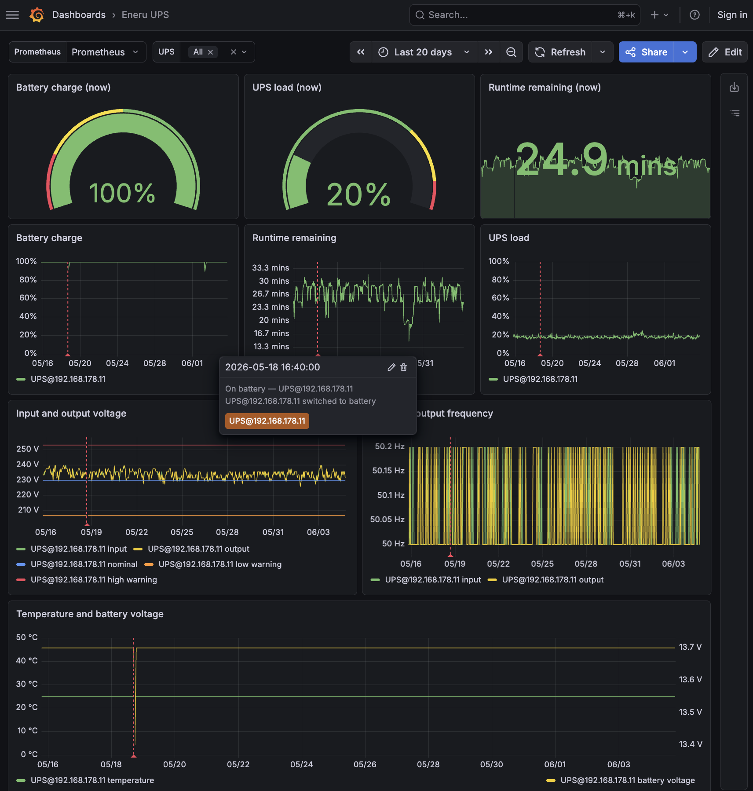

# Observability and API

Eneru v5.3+ includes read-only observability endpoints and outbound integrations. None of the API or MQTT surfaces here can trigger UPS shutdown, mutate state, or run commands you did not already configure for the daemon. **Remote-health probes do execute SSH commands** against your configured remote servers, but they are restricted to the harmless `probe_command` (`true` by default) and never touch your `pre_shutdown_commands` or `shutdown_command`. See "Remote SSH health" below for the safety contract.

## API server

The API starts with `eneru run` when explicitly enabled:

```yaml
api:
  enabled: true
  bind: "127.0.0.1"
  port: 9191
```

**v6.1.7 upgrade note:** hostname access that was previously accepted (for
example `nas.local` or a reverse proxy preserving its public Host) now needs an
`api.allowed_hosts` entry. A rejected request returns 421 and Eneru logs the
first rejected Host with this configuration hint, so a suddenly blank
dashboard has a searchable server-side explanation.

For container healthchecks, the same settings can be enabled at runtime:

```bash
eneru run --config /etc/ups-monitor/config.yaml \
  --api --api-bind 0.0.0.0 --api-port 9191
```

Endpoints:

| Endpoint | Purpose | Status codes |
|----------|---------|--------------|
| `/health` | API process is alive | 200 |
| `/ready` | Monitoring has usable UPS visibility and every configured shutdown capability is achievable | 200 ready / 503 not ready |
| `/api/v1` | API endpoint index | 200 |
| `/api/v1/ups` | Current UPS/group status | 200 |
| `/api/v1/ups/<name>` | One UPS status | 200 / 404 |
| `/api/v1/ups/<name>/history` | SQLite metric history (`metric`, `from`, `to`) | 200 / 400 (bad metric or `from > to`) / 404 |
| `/api/v1/ups/<name>/shutdown-plan` | Read-only ordered shutdown plan for one UPS | 200 / 404 |
| `/api/v1/ups/<name>/shutdown-progress` | Current or most recent shutdown progress for one UPS | 200 / 404 |
| `/api/v1/redundancy-groups/<name>/shutdown-plan` | Read-only group-owned shutdown plan | 200 / 404 |
| `/api/v1/redundancy-groups/<name>/shutdown-progress` | Current or most recent group shutdown progress | 200 / 404 |
| `/api/v1/events` | Recent event rows (`limit`, `verbosity`, `from`, `to`, `before`) | 200 / 400 (bad query) |
| `DELETE /api/v1/ups/<name>/events` | Delete selected events (auth required) | 200 / 400 / 401 / 403 / 404 / 413 / 503 |
| `/api/v1/config` | Sanitized config summary | 200 |
| `/api/v1/auth/state` | Effective auth state for dashboard login bootstrap | 200 |
| `/api/v1/remote-health` | Remote SSH health status | 200 |
| `/metrics` | Prometheus text metrics | 200 / 404 (Prometheus disabled) |

Shutdown-progress responses expose phase and remote outcome states, timestamps,
and pre-command counts. For anonymous readers, error details are fixed messages
and command output stays in the service logs, so open read access cannot leak
it. Authenticated readers (`remoteDetailAvailable: true`) also get a `detail`
object per finished remote: the final shutdown command's `exitCode` (`null` when
it never ran, e.g. dry-run), its combined stdout/stderr `response`, and the raw
`error` / `preCommandsError` text. Those strings pass a best-effort credential
redaction (`key=value`, `key: value`, `--flag value`, JSON keys, URL userinfo,
`Authorization` headers) and are capped at the last 8,000 characters. Output of
a remote that timed out is kept even when it arrives after the deadline. The
dashboard shows this detail in a pop-up when you click a remote's result badge
on the Shutdown tab.

### What happens next, and how fresh is it (v6.2)

Think of these fields as the car's fuel gauge rather than its engine. The
daemon's trigger code decides when to shut down; these fields read the same
inputs and show how close each trigger is, when it would fire, and what firing
would do for this UPS. Nothing reads them back into a decision, and unit tests
pin their comparisons to the trigger code.

Each UPS row in `/api/v1/ups` and `/api/v1/ups/<name>` adds:

| Field | Meaning |
|-------|---------|
| `statusSummary` | `{state, label, severity, blink, detail, tokens}`: one short label per state (`On mains`, `On battery`, `Low battery`, `Shutdown triggered`, `Shutting down`, ...) and a 3-level `severity` (`ok` / `warn` / `crit`). `blink` is true only for `shutting_down` and `trigger_active`. `detail` is the full token-by-token text. |
| `triggerOutlook` | `{onBattery, timeOnBattery, stabilizing, stabilizationRemaining, triggers[], firing[], next, summary, action}`. `triggers[]` always lists `fsd`, `failsafe`, `lowBattery`, `criticalRuntime`, `depletionRate`, `extendedTime` and `selfTestFailure`, each with `state` (`idle` / `ok` / `held` / `fired` / `disabled` / `unknown`), `value`, `threshold`, `unit`, `margin`, `etaSeconds`, `etaBasis`, `condition` and `text`. |
| `nextTrigger` | The closest trigger: the first one that has fired, otherwise the one with the smallest `etaSeconds`, otherwise `null`. |
| `role` | `{kind, label, shutsDownLocalHost, localDrain, remoteServers, hasShutdownActions, redundancyGroups, dryRun}`. `kind` is `local`, `remote-only`, `monitor-only` or `redundancy-member`, derived from the same shutdown plan the Shutdown tab shows. |
| `triggerOutlook.action` | `{kind, label, groups}`: `local-shutdown`, `remote-shutdown`, `notify-only` or `redundancy-advisory`, with a one-line label such as "Shuts down this host and 2 remote servers". |
| `freshness` | `{lastPollAt, ageSeconds, staleAfterSeconds, stale}`. `lastPollAt` is epoch seconds. A poll is stale after `max(3 × check_interval, 30 s)`. |
| `timeOnBatteryText`, `runtimeText` | Pre-formatted durations (`24m 50s`); `timeOnBatteryText` is `null` on mains. |
| `batteryHealth.replacement` | `{days, years, text, source, capped, beyond}`. The trend estimate is capped at the calendar estimate (`expected_life_years` minus the battery's age) and at 10 years (`"> 10 yr"`). `replacementDaysRemaining` uses the same cap. |

`/api/v1/ups` and `/api/v1/ups/<name>` both carry `generatedAt`, the server's
epoch time when the payload was built. ETA rules: low battery uses the current
drain rate, critical runtime assumes the runtime counts down in real time, and
the time-based triggers use the clock. No ETA is shorter than the remaining
on-battery stabilization hold.

Redundancy-group rows add `failingMembers`, `healthyMembers`,
`failuresTolerated` (`healthyCount - minHealthy`, negative once quorum is lost),
`role`, and `outlook` (`{state, severity, label, action}`, where `state` is one
of `healthy`, `at-risk`, `quorum-lost`, `deferred` or `shutting-down`). Each
member row also gains `nextTrigger`, evaluated with the group's thresholds, and
`healthReason` ("on battery", "no data", "Critical runtime: 4m 40s now ...").

`/api/v1/ups/<name>/shutdown-plan` adds `triggers` (`conditions` as
human-readable lines, `stabilizationDelay`, the live `outlook`, and `action`)
and `role`. The redundancy-group plan adds `triggers.conditions` (the quorum
rule), `triggers.memberConditions` and `role`.

**Status vocabulary.** The dashboard, `eneru monitor` and the API use the same
words:

| NUT status / Eneru state | `state` | Label | Severity |
|--------------------------|---------|-------|----------|
| `FSD`, or a shutdown in progress | `shutting_down` | Shutting down | crit (blinks) |
| a trigger has fired | `trigger_active` | Shutdown triggered | crit (blinks) |
| NUT unreachable | `connection_lost` | Connection lost | crit on battery, warn otherwise |
| data older than the stale limit | `stale` | Stale data | warn |
| `OFF` | `output_off` | UPS output off | crit |
| `LB` | `low_battery` | Low battery | crit |
| `OB` | `on_battery` | On battery | warn |
| `BYPASS` | `bypass` | On bypass | warn |
| `OL` | `online` | On mains | ok (warn with `ALARM`, `OVER` or `RB`) |
| `WAIT` or empty | `waiting` | Waiting for data | warn |
| anything else | `unknown` | Status unknown | warn |

**State file.** `eneru monitor` reads the per-UPS state file
(`logging.state_file`, suffixed per UPS in multi-UPS mode). Besides the old
keys it holds `EPOCH` (epoch seconds of the last good poll), `TIMESTAMP_ISO`
(with the UTC offset), `CHECK_INTERVAL`, `TIME_ON_BATTERY`, `ON_BATTERY_SINCE`,
`DEPLETION_RATE`, `TRIGGER_ACTIVE`, `TRIGGER_REASON` and
`SELF_TEST_ATTRIBUTED`. `TIMESTAMP` keeps its old naive local-time format for
existing scripts; use `EPOCH` to show local time or age. Shutdown progress is
mirrored to `<state file>.shutdown-progress.json` (and
`<state_file>.redundancy-<group>.shutdown-progress.json` for groups). Each
mirror holds the anonymous snapshot shown above plus `writtenAt`, never
command output, and is reset to `idle` when the daemon starts.

The API is disabled by default. When enabled, the default bind address is localhost. If you set `api.bind` to a non-loopback address (e.g. `0.0.0.0`) **without** enabling authentication, Eneru warns at startup: `/api/v1/config` returns configured server hostnames and presence flags, so anyone who can reach the socket can read that. Keep the API behind SSH, a local reverse proxy, a trusted network boundary, or enable `api.auth`.

**No built-in TLS — trusted-LAN by design.** Eneru serves plain HTTP and does not terminate TLS itself; this is a deliberate scope decision for a homelab-scale, trusted-LAN daemon, not an oversight. On the default loopback bind nothing leaves the host. If you must reach the API from another machine, do not expose the plain-HTTP socket directly — put it behind a reverse proxy that terminates TLS (and, ideally, adds auth), and keep the daemon itself on loopback. Bearer tokens and login passwords travel in cleartext on any non-loopback plain-HTTP bind, so treat an unproxied off-host bind as readable by anyone on the wire.

**DNS-rebinding protection.** Because read endpoints are open by default, a hostile web page loaded in an operator's browser could otherwise use DNS rebinding to point a name it controls at the daemon's LAN IP and read the API (topology, SSH usernames, events) from inside the browser. Eneru validates the request `Host` header: an IP-literal Host (`192.168.1.10:9191`, `[::1]:9191`) or `localhost` is always accepted — so browsing the dashboard by IP is unaffected — while a request carrying any other DNS name is answered `421 Misdirected Request` and never routed. If you front the API with a hostname (e.g. behind a reverse proxy or a friendly LAN name), list the names you serve it under in `api.allowed_hosts` (case-insensitive):

```yaml
api:
  allowed_hosts:
    - eneru.lan
    - ups.example.com
```

### Authentication (v6.0)

Authentication is opt-in via `api.auth.enabled` and is **tiered**. The login body
is a JSON object: `{"username": "<username>", "password": "<password>"}`.

| Surface | `auth.enabled=false` | `auth.enabled=true` |
|---------|----------------------|---------------------|
| `/health`, `/ready` | open | open (always) |
| `/metrics`, `/api/v1/ups*`, `/api/v1/redundancy-groups/*`, `/history`, `/events`, `/remote-health` | open | open unless `require_for_reads` |
| `/api/v1/config` | sanitized | sanitized (anonymous) / **extended** (authenticated) |
| Audit rows in `/api/v1/events` (`CONTROL_*`, `CONFIG_RELOAD`, `EVENTS_DELETED`, `LOGIN_FAILURE`) | shown | hidden (anonymous) / shown (authenticated) |
| Remote-check error text (`last_error` in `/remote-health` and in the `remoteHealth` rows of `/api/v1/ups` and `/api/v1/ups/{name}`, the loopback `lastError` in `/ready` and `/api/v1/ups`) | shown | `check failed; sign in for details` (anonymous) / full text (authenticated) |
| `/api/v1/auth/state` | open | open (always) |
| write endpoints (UPS control, config reload) | **hard-disabled (403)** | required (401 without a credential) |

> **`/metrics` discloses topology.** Prometheus label values include UPS names
> and other identifying detail. `/metrics` honors `require_for_reads` like the
> other read endpoints, but if you scrape it through a proxy, put `/metrics`
> behind the **same** auth boundary as the rest of the read API — don't expose
> it unauthenticated just because a scraper is easier to wire up that way.

"Auth disabled" always means read-only: write features cannot be reached, and enabling a control feature while auth is off is a startup error. If `api.auth.enabled` is left unset, auth activates automatically once the auth DB contains at least one user; if the DB file exists but cannot be read, Eneru fails closed and treats auth as active. See [Authentication](authentication.md) for the user/API-key model and the `eneru user` / `eneru apikey` CLI.

**Logging in.** `POST /api/v1/auth/login` with a JSON body `{"username": "<username>", "password": "<password>"}` returns a bearer token:

```json
// POST /api/v1/auth/login  ->  200
{"token": "…", "tokenType": "bearer", "expiresIn": 3600}
```

Send it as `Authorization: Bearer <token>` on subsequent requests (programmatic clients send an API key the same way, or via `X-API-Key`). `POST /api/v1/auth/logout` invalidates a session token. Sessions live in memory, expire after `api.auth.session_ttl` seconds, and are invalidated if the user is deleted or their password is reset; they do not survive a daemon restart.

Example response shapes:

```json
// GET /api/v1/ups
{
  "generatedAt": 1720000000.0,
  "ups": [
    {
      "name": "ups0", "label": "Rack-A", "groupId": "ups0",
      "status": "OL CHRG", "batteryCharge": 97, "runtime": 1200,
      "load": 20, "depletionRate": 0.0, "timeOnBattery": 0,
      "powerQuality": {
        "inputVoltage": "229.4", "outputVoltage": "230.1",
        "batteryVoltage": "27.2", "temperature": "32",
        "inputFrequency": "50.0", "outputFrequency": "50.0",
        "voltageState": "NORMAL", "avrState": "INACTIVE",
        "bypassState": "INACTIVE", "overloadState": "INACTIVE",
        "nominalVoltage": 230.0, "warningLow": 207.0, "warningHigh": 253.0
      },
      "connectionState": "OK", "triggerActive": false,
      "remoteHealth": [...]
    }
  ],
  "redundancyGroups": []
}

// GET /api/v1/events?limit=2&verbosity=1
{"generatedAt": 1720000000.0, "events": [{"ts": 1720000000, "category": "power_event", "event": "ON_BATTERY", "details": "..."}]}
```

UPS rows include a stable `groupId` derived from the configured UPS name. Multi-UPS responses also include `redundancyGroups` rows with their source UPS names, quorum target, server-computed `healthyCount` / `quorumLost`, per-member raw/effective health, locality flag, and remote-health rows. During evaluator cold start, `quorumDeferred` is `true` and `quorumLost` remains `false` until members have had their first-report window.

`powerQuality` mixes JSON strings and numbers by source: raw NUT readings (`inputVoltage`, `outputVoltage`, `batteryVoltage`, `temperature`, `inputFrequency`, `outputFrequency`) and state labels (`voltageState`, `avrState`, `bypassState`, `overloadState`) are strings; Eneru-derived values (`nominalVoltage`, `warningLow`, `warningHigh`) are numbers. Strings are empty when the UPS does not publish that NUT field. Consumers that compare numeric ranges should coerce the string fields with `float()` (or `| float` in Home Assistant templates) and treat empty strings as missing data.

`/api/v1/events` accepts `limit` and `verbosity` query parameters. `verbosity=0` returns power/shutdown events, `verbosity=1` also includes diagnostics, and `verbosity=2` returns all recorded events including lifecycle rows.

For wide-range viewing and paging, `/api/v1/events` also accepts `from`/`to` (Unix seconds) and a source-qualified cursor: `before=<ts>&beforeSource=<source>&beforeId=<id>`, using the oldest row already displayed. Each event row carries the required identity: `source` (the UPS `groupId`) plus `id` (a stable, never-reused per-UPS row id), alongside `ts`, `eventType`, and `detail`. Clients should still de-duplicate loaded pages by `(source, id)`. A timestamp-only `before=<ts>` is accepted for compatibility and uses an inclusive timestamp boundary. Likewise, `/api/v1/ups/<name>/history` accepts `from`/`to`; omitting `from` returns from the earliest retained data (the hourly-aggregate retention horizon), and `from > to` is a 400.

**Deleting events.** `DELETE /api/v1/ups/<name>/events` removes selected events. It requires authentication (writes are hard-disabled when `api.auth` is off -> 403; missing credential -> 401). The JSON body is `{"items": [{"id": <int>, "ts": <int>, "eventType": "<str>"}, ...]}` (max 1000 items -> 413; malformed -> 400). Each row is matched on all three fields, so a stale client can only delete the exact rows it last saw. A mismatch deletes nothing. The response is `{"ups": "<name>", "deleted": <count>, "protected": <count>}`; if statistics is disabled the endpoint returns 503. Deletions are recorded to the events table as `EVENTS_DELETED` audit rows. Audit rows (`CONTROL_*`, `CONFIG_RELOAD`, `EVENTS_DELETED`, `LOGIN_FAILURE`) can't be deleted through the API: they are skipped, the rest of the selection is still deleted, and the skipped count is returned as `protected` and noted in the audit line.

## Transport security

The embedded API speaks **plain HTTP** — it has no built-in TLS. On loopback
(`127.0.0.1`, the default) that is fine. If you bind it to a routable address,
login passwords and bearer tokens travel unencrypted, so put a TLS-terminating
reverse proxy in front and keep the daemon on loopback. The daemon logs a
cleartext-transport warning at startup for any non-loopback bind.

Minimal Caddy:

```caddyfile
ups.example.com {
    reverse_proxy 127.0.0.1:9191
}
```

Minimal nginx:

```nginx
server {
    listen 443 ssl;
    server_name ups.example.com;
    ssl_certificate     /etc/ssl/ups.crt;
    ssl_certificate_key /etc/ssl/ups.key;
    location / { proxy_pass http://127.0.0.1:9191; }
}
```

Then set `api.bind: 127.0.0.1` and point clients at the proxy.

> **Note on login throttling behind a proxy.** The daemon's built-in login
> throttle (10 failed logins per minute → HTTP 429) keys on the *immediate*
> peer IP. Behind a reverse proxy every request appears to come from the proxy
> (loopback), so the throttle becomes global — a burst of bad logins can return
> 429 to all users at once. `X-Forwarded-For` is deliberately not trusted (it's
> spoofable). When you front Eneru with a proxy, rely on the **proxy's** own
> per-client rate limiting for login endpoints and treat the daemon throttle as
> a coarse backstop.

There is also a separate process-wide ceiling of 100 failed logins in 300
seconds across all source addresses. It is a distributed-attack backstop: once
tripped, every operator receives 429 until the sliding window drains.

## Health and readiness

`/health` returns 200 when the API server can answer.

`/ready` returns 200 only when monitoring has usable UPS data and every configured shutdown capability is achievable. It returns 503 if UPS visibility is failed, a required local binary is missing on native installs, or a containerized local-host config lacks a healthy loopback delegate.

## Prometheus

Prometheus metrics are served from the same API port:

```yaml
prometheus:
  enabled: true
```

Prometheus scrape example:

```yaml
scrape_configs:
  - job_name: eneru
    scrape_interval: 15s
    static_configs:
      - targets: ["127.0.0.1:9191"]
```

Useful metric names include:

| Metric | Meaning |
|--------|---------|
| `eneru_up` | API serving metrics |
| `eneru_ups_battery_charge` | Battery percentage |
| `eneru_ups_runtime_seconds` | UPS runtime estimate |
| `eneru_ups_load_percent` | UPS load |
| `eneru_ups_input_voltage` | Input voltage |
| `eneru_ups_output_voltage` | Output voltage |
| `eneru_ups_battery_voltage` | Battery voltage |
| `eneru_ups_input_frequency_hz` | Input frequency |
| `eneru_ups_output_frequency_hz` | Output frequency |
| `eneru_ups_temperature_celsius` | UPS temperature |
| `eneru_ups_nominal_voltage` | Snapped nominal grid voltage |
| `eneru_ups_voltage_warning_low` | Derived low-voltage warning threshold |
| `eneru_ups_voltage_warning_high` | Derived high-voltage warning threshold |
| `eneru_ups_voltage_state` | Current grid-quality state label |
| `eneru_ups_avr_state` | Current AVR state label |
| `eneru_ups_bypass_state` | Current bypass state label |
| `eneru_ups_overload_state` | Current overload state label |
| `eneru_ups_depletion_rate_percent_per_minute` | Eneru depletion-rate calculation |
| `eneru_ups_connection_failed` | UPS visibility failed |
| `eneru_ups_trigger_active` | Shutdown trigger active/advisory |
| `eneru_remote_health_status` | Last remote health state |

`examples/grafana-dashboard.json` is a starting dashboard for these metrics.
It is Prometheus-only and ships with a `$ups` template variable plus
dashboard-wide annotations sourced from existing Prometheus signals
(`eneru_ups_time_on_battery_seconds > 0` for power cuts, the voltage /
AVR / bypass / overload state metrics for power-quality events, plus
`eneru_ups_trigger_active`, `eneru_ups_connection_failed`, and
`eneru_remote_health_status{status="FAILED"} == 1`). Annotations render as
coloured regions across every time-series panel, so a power cut is
visible directly on the Battery-charge and Runtime-remaining curves and a
brownout is visible directly on the Input/output voltage panel — no extra
Grafana plugin required. Exact SQLite event rows with their full detail
text remain available from `/api/v1/events` if you want a tabular feed.

{ width="900" }

## Remote SSH health

Remote healthchecks are enabled by default for configured remote servers. They run a separate harmless probe command, default `"true"`.

```yaml
remote_health:
  enabled: true
  startup_check: true
  interval: 3600
  probe_command: "true"
  failure_threshold: 2
```

Healthchecks never execute `pre_shutdown_commands`, VM/container shutdown commands, custom commands, or `shutdown_command`. Remote health is advisory: during a real shutdown sequence Eneru still attempts the configured remote command chain with bounded timeouts. Failed or unreachable remote targets are reported in the remote shutdown summary and do not block later shutdown phases indefinitely.

The daemon marks a failed probe as `DEGRADED` until `failure_threshold` is reached, then marks it `FAILED`. It sends at most one failure notification for that failed period and one recovery notification when the target returns. State transitions are also recorded in the SQLite `events` table.

## MQTT

MQTT publishing is outbound only and disabled by default:

```yaml
mqtt:
  enabled: false
  broker: "mqtt://192.0.2.10:1883"
  topic_prefix: "eneru"
  publish_interval: 10
```

**Topic, QoS, retention.** All snapshots publish to `<topic_prefix>/status` (default `eneru/status`) with **QoS 0** and **retain=False**. The payload is the same JSON object served by `/api/v1/ups`, sorted by key for stable diffing on the consumer side. The publisher emits a new message every time the status fingerprint (everything except `generatedAt`) changes, and republishes at `publish_interval` seconds while unchanged so consumers always have a recent sample.

Home Assistant example using the MQTT integration. The numeric power-quality fields can be empty strings when the UPS does not report a value, so the templates default to `none` (sets the sensor to `unavailable`) instead of raising a conversion error:

```yaml
mqtt:
  sensor:
    - name: "Eneru UPS battery"
      state_topic: "eneru/status"
      value_template: "{{ value_json.ups[0].batteryCharge | float(default=none) }}"
      unit_of_measurement: "%"
    - name: "Eneru input voltage"
      state_topic: "eneru/status"
      value_template: "{{ value_json.ups[0].powerQuality.inputVoltage | float(default=none) }}"
      unit_of_measurement: "V"
    - name: "Eneru grid quality"
      state_topic: "eneru/status"
      value_template: "{{ value_json.ups[0].powerQuality.voltageState }}"
```

**Reconnect.** On a failed connect or unexpected disconnect, the publisher retries with bounded exponential backoff (1 s → 2 s → 4 s → … capped at 60 s) and resumes publishing automatically once the broker is reachable again. The reconnect loop is interrupted by daemon shutdown, so a hung broker can't delay `eneru` exiting.

**TLS.** Set the broker URL to `mqtts://...` to enable TLS using the system trust store. Default port is 8883 unless explicitly given. mTLS / client certificates are not supported in v5.3.

**Packaging.** Debian/Ubuntu `.deb` packages install `python3-paho-mqtt` as a hard dependency. RPM packages list it under `Recommends:` only, so the install never fails without it. EPEL ships it for RHEL 9 and RHEL 10, and dnf pulls it in automatically when EPEL is enabled. Without EPEL, install it via pip after installing eneru:

```bash
# With EPEL (RHEL 9 / 10):
sudo dnf install python3-paho-mqtt

# Without EPEL, RHEL 10 (PEP 668 — system site-packages externally managed):
python3 -m pip install --break-system-packages paho-mqtt

# Without EPEL, RHEL 9 (older pip, no PEP 668 marker):
python3 -m pip install paho-mqtt
```

For PyPI installs use the optional extra:

```bash
uv pip install "eneru[mqtt]"
```

If MQTT is enabled but `paho-mqtt` isn't importable, the publisher logs a warning at startup and disables itself; the daemon keeps running normally. No inbound MQTT commands are supported in v5.3.

## JSON logs and syslog

Use JSON logs for SIEM pipelines:

```yaml
logging:
  format: "json"
```

Each line is a JSON object with `timestamp`, `level`, `logger`, `message`, and, when the call site supplies them, `category`, `event_type`, `group`, `ups`, and `server`. Power events, shutdown sequences, and remote-health transitions all set the structured fields explicitly; older call sites fall back to a heuristic that parses the message text, so existing log pipelines keep working unchanged.

Forward logs to syslog:

```yaml
logging:
  syslog:
    enabled: true
    address: "/dev/log"
    facility: "daemon"
```

Eneru uses Python's standard `logging.handlers.SysLogHandler`, which emits **RFC 3164 (BSD syslog)** format. RFC 5424 structured-data support is not available in v5.3. The existing local power-event `logger -t eneru` compatibility path remains.
